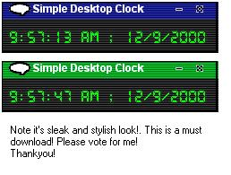



## The Coolest CLOCK\!\! You have to see this\!\!\!

### Description

It shows you how to display time and dates. how to set alarms, how to create graphical forms with images , how to use menu items.
 
### More Info
 
The Time and Data!

             |
---                |---
**Submitted On**   |2000-12-09 09:55:48
**By**             |[Alex](https://github.com/Planet-Source-Code/PSCIndex/blob/master/ByAuthor/alex.md)
**Level**          |Intermediate
**User Rating**    |4.5 (45 globes from 10 users)
**Compatibility**  |VB 4\.0 \(16\-bit\), VB 4\.0 \(32\-bit\), VB 5\.0, VB 6\.0
**Category**       |[Complete Applications](https://github.com/Planet-Source-Code/PSCIndex/blob/master/ByCategory/complete-applications__1-27.md)
**World**          |[Visual Basic](https://github.com/Planet-Source-Code/PSCIndex/blob/master/ByWorld/visual-basic.md)
**Archive File**   |[CODE\_UPLOAD125021292000\.zip](https://github.com/Planet-Source-Code/alex-the-coolest-clock-you-have-to-see-this__1-13455/archive/master.zip)

